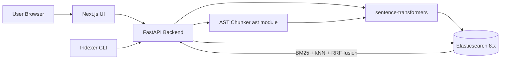

# Semantic Code Search

A hybrid (BM25 + dense vector) search engine over **AST-aware Python code chunks**, built with FastAPI, Elasticsearch 8, sentence-transformers, and a Next.js 14 UI. All services orchestrated via Docker Compose.

## Architecture



## What it does

- **AST-aware chunking** (Python `ast`): one chunk per `function`, `async function`, `method`, `class`, plus a "module residue" chunk for top-level code. Each chunk preserves `qualified_name`, `signature`, `docstring`, and exact line range.
- **Local embeddings** via `sentence-transformers` (default: `jinaai/jina-embeddings-v2-base-code`, 768-dim, code-aware). Runs entirely on-device; no third-party API key required.
- **Hybrid retrieval** by running BM25 `multi_match` (over `code`/`docstring`/`qualified_name`/`signature`) and kNN on `dense_vector` separately, then fusing hit lists with reciprocal rank fusion in Python (optional native ES `rrf` helpers live in `search/hybrid.py` if your cluster supports them).
- **REST API** (FastAPI): `/index`, `/search`, `/index/stats`, `/health`. Auto-generated Swagger at `/docs`.
- **UI** (Next.js + Tailwind + Shiki): query box, k & mode selectors, repo filter, syntax-highlighted result cards, and `vscode://` deeplinks to jump straight into the source.

## Quickstart

### Option A: Docker Compose (recommended)

```bash
cp .env.example .env          # tweak EMBEDDING_MODEL etc. if you want
docker compose up -d --build
open http://localhost:3000    # UI
open http://localhost:8000/docs  # API docs
```

The first request to `/search` or `/index` will download the embedding model into the `hf-cache` Docker volume (cached afterwards).

### Option B: Native (no Docker, macOS)

If you don't have Docker, use the bundled `scripts/native.sh`. It downloads
Elasticsearch 8.14.3 into `./.local`, sets up a Python venv, installs the
frontend, and supervises all three services with PID + log files.

```bash
./scripts/native.sh setup       # one-time: download ES + pip install + npm install
./scripts/native.sh up          # start ES + backend + frontend in the background
./scripts/native.sh status      # see pids + ES + backend health
./scripts/native.sh index       # clones psf/requests into samples/ and indexes it
./scripts/native.sh logs backend
./scripts/native.sh down        # stop everything
```

Then open http://localhost:3000.

### Index every Python repo from a GitHub user

```bash
./scripts/index-github-user.sh <github-username>
# e.g.
./scripts/index-github-user.sh shruthikatta
./scripts/index-github-user.sh shruthikatta --drop                # rebuild index
./scripts/index-github-user.sh shruthikatta --include-non-python  # also clone non-Python
```

The script lists the user's public, non-fork, non-archived repos via the
GitHub API, clones each Python repo into `samples/`, and POSTs `/index` for it.
Equivalent backend endpoint:

```bash
curl -X POST http://localhost:8000/index/github \
  -H 'Content-Type: application/json' \
  -d '{"owner":"shruthikatta","drop_existing":true}'
```

### Index a real repository

The `samples/` folder is mounted read-only into the backend at `/samples`, so anything cloned there can be indexed by absolute path inside the container. The `/index` endpoint **rejects any path that does not resolve under `samples_dir`** to keep the indexer scoped to repos you have explicitly cloned.

```bash
mkdir -p samples
git clone --depth 1 https://github.com/psf/requests.git samples/requests

curl -X POST http://localhost:8000/index \
  -H 'Content-Type: application/json' \
  -d '{"path": "/samples/requests", "repo": "requests", "drop_existing": true}'
```

You should see a response like:

```json
{
  "repo": "requests",
  "files_scanned": 38,
  "files_parsed": 38,
  "chunks_indexed": 412,
  "total_loc": 8123,
  "duration_seconds": 27.4
}
```

For a larger corpus, clone additional repos like `flask`, `fastapi`, or `django` into `samples/` and re-run `/index` (without `drop_existing`) for each one.

### Search from the CLI

```bash
curl 'http://localhost:8000/search?q=retry+with+exponential+backoff&k=5&mode=hybrid' | jq
```

### Demo script (BM25 vs hybrid)

```bash
./scripts/demo.sh https://github.com/psf/requests.git requests
```

prints the top 3 results for each canned query under both `mode=bm25` and `mode=hybrid` so you can see the relevance lift from RRF fusion.

## API

| Method | Path            | Description                                                                 |
| ------ | --------------- | --------------------------------------------------------------------------- |
| GET    | `/health`       | Service + Elasticsearch reachability + embedding model info                 |
| POST   | `/index`        | Body `{ "path": "/abs/path", "repo": "name", "drop_existing": false }`      |
| GET    | `/index/stats`  | Doc count and list of indexed repos                                         |
| DELETE | `/index`        | Drop and recreate the index                                                 |
| GET    | `/search`       | `q=...&k=10&mode=hybrid|bm25|vector&repo=...`                                |

## Repository layout

```
semantic-code-search/
  backend/
    app/
      main.py                   FastAPI app + CORS + startup
      core/                     config, ES client, index schema
      chunker/python_ast.py     AST-aware chunking
      embeddings/local.py       sentence-transformers wrapper
      indexer/service.py        walk repo, chunk, embed, bulk-index
      search/hybrid.py          RRF query builders
      api/{indexing,search}.py  routers
      models/schemas.py         pydantic DTOs
    tests/                      pytest (chunker, hybrid query, e2e)
    Dockerfile
    requirements.txt
  frontend/
    app/                        Next.js App Router pages
    components/                 SearchBar, ResultCard (Shiki)
    lib/api.ts                  typed client
    Dockerfile
  docker-compose.yml
  scripts/demo.sh
  samples/                      mount point for repos to index (gitignored)
```

## Development

### Backend

```bash
cd backend
python -m venv .venv && source .venv/bin/activate
pip install -r requirements.txt
ELASTICSEARCH_URL=http://localhost:9200 uvicorn app.main:app --reload
```

### Tests

Fast unit tests (no ES, no model download):

```bash
cd backend
pip install pydantic pydantic-settings pathspec pytest
pytest tests/test_chunker.py tests/test_hybrid_query.py
```

End-to-end test against a running stack:

```bash
docker compose up -d
RUN_E2E=1 pytest tests/test_e2e_search.py -m e2e
```

### Frontend

```bash
cd frontend
npm install
NEXT_PUBLIC_API_BASE=http://localhost:8000 npm run dev
```

## Configuration

All settings are read from environment variables (see `.env.example`):

| Variable                | Default                                  | Notes                                          |
| ----------------------- | ---------------------------------------- | ---------------------------------------------- |
| `ELASTICSEARCH_URL`     | `http://elasticsearch:9200`              | ES endpoint                                    |
| `ES_INDEX`              | `code_chunks`                            | Index name                                     |
| `EMBEDDING_MODEL`       | `jinaai/jina-embeddings-v2-base-code`    | Any sentence-transformers model id             |
| `EMBEDDING_DIM`         | `768`                                    | Must match the model                           |
| `EMBEDDING_BATCH_SIZE`  | `32`                                     |                                                |
| `INDEX_BULK_CHUNK_SIZE` | `200`                                    | Chunks per bulk request to ES                  |
| `INDEXER_MAX_FILE_BYTES`| `2097152`                                | Skip `.py` files larger than this              |
| `EMBEDDING_TRUST_REMOTE_CODE` | `false`                            | Allow sentence-transformers to execute model-side Python; required by the default Jina model |
| `SAMPLES_DIR`           | `/samples`                               | Host root that `/index` paths must live under  |
| `CORS_ORIGINS`          | `http://localhost:3000`                  | Comma-separated allow-list for the backend     |
| `NEXT_PUBLIC_API_BASE`  | `http://localhost:8000`                  | Baked into the frontend bundle at build time   |

## Security & threat model

This project is designed as a **single-tenant developer tool you run on your own
machine**. Do not expose it to the public internet without adding the controls
listed under "Out of scope" below. The repo ships with the following defaults
to make accidental exposure harder:

| Concern | Default |
| --- | --- |
| `/index` path traversal / arbitrary file read | Paths are resolved and must live under `SAMPLES_DIR`; otherwise rejected with `400`. |
| `/index/github` SSRF / abuse | `owner` and `repos` are validated against GitHub's naming rules; the GitHub API client refuses any host other than `api.github.com` and **blocks HTTP redirects** so a malicious response can't redirect into private addresses. `git clone` only accepts `https://github.com/...` URLs. |
| Malicious repo on `git clone` | `git clone` runs with `GIT_TERMINAL_PROMPT=0`, `GIT_LFS_SKIP_SMUDGE=1`, `GIT_CONFIG_NOSYSTEM=1`, `protocol.allow=never` / `protocol.https.allow=always`, `core.symlinks=false`, `core.hooksPath=/dev/null`, `--no-tags`, `--no-recurse-submodules`, and a 5-minute timeout. |
| `/search` request flooding | Query string is capped at 2000 chars; `repo` filter is regex-validated. |
| Indexer DoS via huge `.py` files | Files larger than `INDEXER_MAX_FILE_BYTES` (default 2 MiB) are skipped. |
| Untrusted embedding model RCE | `EMBEDDING_TRUST_REMOTE_CODE` defaults to `false`. Only enable it for a model whose Python code you have reviewed; the default Jina model needs it on, but switching to e.g. `sentence-transformers/all-MiniLM-L6-v2` lets you keep it off. |
| CORS | Allow-list defaults to `http://localhost:3000`. Override via `CORS_ORIGINS` (comma-separated). |
| Network exposure | `docker-compose.yml` binds Elasticsearch, the backend, and the UI to `127.0.0.1` only. `scripts/native.sh` binds the backend to `127.0.0.1` as well. |
| Container hardening | The backend image is a multi-stage build that drops `build-essential` from the runtime layer and runs as a non-root `app` user. The frontend image runs as a non-root `nextjs` user. The `samples/` mount is read-only. |
| Error responses | 5xx responses return a generic message; full tracebacks are written to the server log only, never to the HTTP body. |
| Secrets | The repo contains no credentials. `.env` is gitignored; see `.env.example` for the full set of knobs. |

If you plan to expose this beyond `localhost`, at minimum add: an auth layer in
front of `/index*` and `DELETE /index`, request-size and rate limits, TLS
termination, and a tighter `CORS_ORIGINS` list.

## Out of scope (today)

- Non-Python languages. The chunker layer is the obvious extension point; `tree-sitter` would be the natural drop-in.
- Hosted embedding providers. The embedder is a single class behind `get_embedder()`, so adding alternative backends is a small change.
- Auth, multi-tenant indices, file-watch incremental reindex, request rate limiting.
